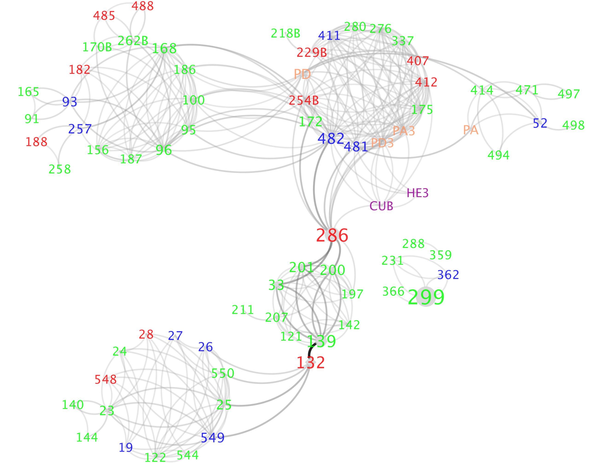
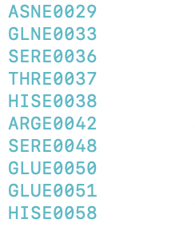

# Compute hydrogen bond network
<small><i>Page last updated on: {{ git_revision_date }}</i></small>
Hydrogen bond network obtained from MCCE is the hydrogen bonds existing in protein in Boltzmann distribution. The network helps reveal proton transclocation pathways, water pathways involving in the protein. The relative publication on [Cytochrome c Oxidase](https://www.sciencedirect.com/science/article/pii/S0005272818301257)



# Table of Contents

1. [Principle](hbexample.md##Principle-of-MCCE-Hydrogen-bond-network-analysis)
2. [Input](hbexample.md##Inputs-for-each-steps)
3. [Output](hbexample.md##Outputs-for-each-steps)
4. [File format](hbexample.md##File-format-for-each-correspinding-file)
5. [Example](hbexample.md##Example-to-run-hydrogen-bond-network-analysis-in-MCCE)
6. [Supplement](hbexample.md##Supplement)


## Principle of MCCE Hydrogen bond network analysis
The hydrogen bond network in MCCE is obtained from microstates in Boltzmann Distribution in Monte Carlo sampling, based on defined D-H...D distance and angle, where D is the donor atom with a lone pair.

1. Save microstates with Boltzmann Distribution in Monte Carlo sampling.
2. Calculate all possible hydrogen bonds exist between residue conformers. A hydrogen bond matrix is obtatined.
3. Calculated hydrogen bonds selected in miscrostates in Monte Carlo sampling.

## Inputs for each steps
1. Monte Carlo sampling microstates is obtained from energies and head3.lst.
2. Hydrogen bond matrix is obtatined from step2_out.pdb and head3.lst.
3. Selected hydrogen bond network is calculated based on hb.dat and microstate file, which is in ms_out folder.

## Outputs for each steps 
1. pH#eH#ms.txt under ms_out folder is generated for each pH and eH titration, where each file is named after titration point of pH and eH value following by 'ms'.
2. Hydrogen bond matrix is saved in hb.dat and hah.txt, where hb.dat is a binary file and hah.txt is a readable txt file. hb.dat has 2D matrix with N * N, where N is the total conformer number in the protein. hah.txt stores the geometry infos for each hydrogen bond. resInHbNet.txt and reshbond.txt
3. pH#eH#hb.txt under hb_out folder is obtained for each pH and eH titration, where each file is named after titration point of pH and eH value foloowing by 'hb'.

## File format for each correspinding file
1. pH#eH#ms.txt: Comment line and blank line are dismissed.
Each file starts with headers, consist of monte carlo sampling unchanged information.
Then it stores the new conformer id for each microstate, and its relative energy and times it stay at this microstate. 

First line: Temperature, pH, eH values
Second line: Method to get microstate. Either MONTERUNS or ENUMERATE, representing from monte carlo sampling or analytical method
Third line: n_fixed, the number of fixed residues for sampling. Following are the occupied conformer ids for each fixed residue, splitted by space.
Fourth line: n_free, the number of free titrated residues that can get flipped during sampling. Follwing are all conformer ids, splitted by space for each free titrated residue, splitted by semicolon.

For each Monte Carlo sampling:
Fifth line: order of monte carlo sampling
Fifth line: n_free, following occupied conformer id for each free titrated residue. This is the starting state for the sampling. The starting state will be decided by its energy to be accpeted or not.
Sixth line: Energy of microstate, counter representing times the microstate stays, new conformer ids compared to last microstate. 

```
T:298.15,pH:7.00,eH:0.00
METHOD:MONTERUNS
#N_FIXED:FIXED_CONF_ID
33:4 5 16 17 18 19 20 35 39 93 94 103 104 105 111 119 128 129 138 145 157 158 176 199 216 217 226 232 239 708 762 854 919
#N_FREE residues:CONF_IDs for each free residues
43:0 1 2 3 ;6 7 10 11 ;27 28 ;29 30 31 32 33 34 ; ...
#EVERY MONTERUN START FROM A NEW STATE
#MC:ITER_MONTERUNS
#N_FREE: FREE_CONF_ID,
#ENERGY, COUNT,NEW_CONF

MC:0
43:1 7 28 31 48 53 56 61 92 106 121 137 140 147 156 167 175 178 183 222 227 234 241 256 269 327 351 383 417 449 472 502 542 552 583 728 769 804 882 945 1008 1059 1112
-93.403641,9,
-93.274643,3,782
-93.646645,1,63
...

MC:1
43:0 7 28 30 48 50 55 60 92 106 127 137 140 146 156 167 175 178 183 222 227 235 245 256 269 327 342 373 417 449 472 502 542 546 594 729 791 797 901 941 1008 1059 1112
-92.401054,3,
-91.990730,4,121 925
-93.319809,9,572
...
```
2. hb.dat: first integer(4 bite): n_conf, the total conformer number of the protein. The following is n_conf * n_conf matrix where 1 represents a hydrogen bond and 0 no hydrogen bond.
3. hah.txt: Conformer_id of Donor   Conformer_id of Acceptor   Donor Atom ~ Hyrogen -- Acceptor Atom  Distance  Angle
```
GLN01A0002_001  HOH01A0109_001   NE2~2HE2-- O   3.02    160
GLN01A0002_001  HOH01A0109_002   NE2~2HE2-- O   3.02    160
```
4. resInHbNet.txt: residue_name involving hydrogen bond network
```
META0001
GLNA0002
TYRA0003
LYSA0004
```
5. reshbond.txt: Residue_name of Donor     Residue_name of Acceptor 
```
GLNA0002        HOHA0109
TYRA0003        META0001
TYRA0003        HOHA0070
TYRA0003        HOHA0132
```
6. pH#eH#hb.txt: Donor Residue      Acceptro Residue       Occupancy of hydrogen bond in all microstates
```
LYSA0050        META0001        1.000
LYSA0050        ASPA0047        1.000
GLNA0002        HOHA0109        0.750
LYSA0004        GLUA0015        1.000
```

## Example to run hydrogen bond network analysis in MCCE
Here is a tutorial to calculate the hydrogen bond network using MCCE 
and visualizing hydrogen bond network using Cytoscape. 

Steps:
1.  First, run MCCE step 6 if you already run from step 1 to step 4 otherwise 
 you need to run from step 1 to step 6. 
step2_out.pdb, ms.dat, ms_gold (old MCCE) are required to run step 6.

Default hydrogen bond definition in run.prm is:

 

You can change hydrogen bond criterion accordingly. 

2. Output file after step 6:

      hb.dat, hah.txt and hb.txt

### Result Analysis:

#### Cytoscape visualization:
We are using Cytoscape for visualizing hydrogen bond networks. 
Download and install Cytoscape (https://cytoscape.org/)

####Input file preparation for Cytoscape:
a. For single hb.txt file:
For the single hydrogen bond network file obtain from the crystal structure, 
you can visualize by directly by opening hb.txt file using Cytoscape 
and selecting different layout.

b. To merge multiple hb.txt obtained by running MCCE from Molecular Dynamics snapshots

To combine multiple hb.txt files obtain from MCCE and see water connected behavior:

Scripts need to have: 

`jhead.h, jhead-test2.cpp, jlu_new-cai.cpp, Makefile`
 and input files: `hb.txt`, `Residues_list.lst`  in the same directory.

First rename hb.txt files into 1.dat, 2.dat .... etc. Suppose if you have 5 hb.txt file then 
rename to 1.dat, 2.dat, 3.dat, 4.dat and 5.dat .
`Residues_list.lst` has information of residues interested for hydrogen bond analysis.

Residues_list.lst looks like this:




a. Open `jhead.h` and here you can change `static int cutoff = 4;` for different water number bridging.
Here 4 is  up to 4 water molecules are allowed to bridge between two residues.
For example: If you want to see up to  two water bridging hydrogen bond connections between two residues, 
then you can change 4 to 2.

b. Open Makefile and you can change `a-4w.out` in makefile:
Here for up to 4 water, we write  `a-4w.out`. Suppose for  two water: change `a-4w.out` to `a-2w.out`

c. Type `make` to compile script:
This will make `a-4w.out`  file. Then run this file by using command: _./a-4w.out_ 

Here output files obtain from MCCE: `out.dat, out_opt.dat, color_map.dat`

Open `out.dat` file using the Cytoscape and play with different layout.


## Supplement
### Comparison between old and new hydrogen bond network
* Comparison between old and new format microstate file
        | old_version | new_version
--------| ----------- | ----------- 
  time  |    58s      |     1s
  size  |    246MB    |     27MB

* Comparison between old and new step 6
        | old_version | new_version
--------| ----------- | ----------- 
  time  |    117s     |     87s